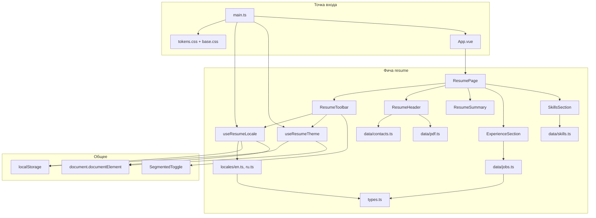
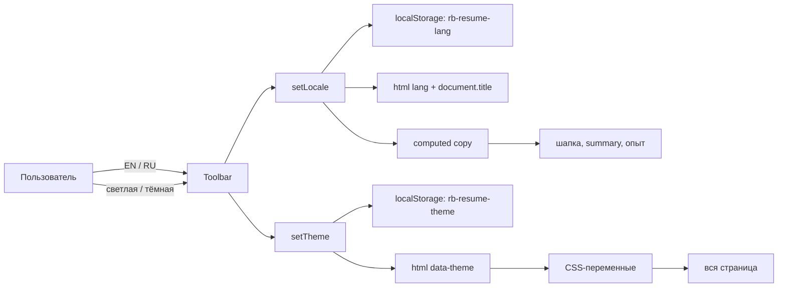

# CV

Одностраничное резюме фронтенд-разработчика. Это не шаблон Vite «из коробки», а готовое приложение: опыт, навыки, контакты и скачивание PDF на английском и русском.

Стек: **Vue 3.5** (Composition API, `<script setup>`), **TypeScript** (strict), **Vite 8**. Состояние локали и темы живёт в composable-ах, данные резюме — в статичных модулях, UI собран по фиче `resume`.

## Что умеет страница

- переключение языка **EN / RU** (тексты, `document.title`, `html[lang]`);
- светлая и тёмная тема (`html[data-theme]`);
- оба выбора сохраняются в `localStorage` и поднимаются при следующем заходе;
- скачивание PDF-версии резюме под текущий язык;
- контакты, опыт работы и список навыков.

## Стек

| Слой     | Выбор                                           |
| -------- | ----------------------------------------------- |
| UI       | Vue 3 SFC, Composition API                      |
| Типы     | TypeScript + `vue-tsc --build`                  |
| Сборка   | Vite, алиас `@` → `src`                         |
| Тесты    | Vitest + Vue Test Utils                         |
| Качество | ESLint, Stylelint, Prettier, Husky, lint-staged |

Роутера, Pinia и HTTP-клиента нет: контент статический, страница одна.

## Как устроено приложение

Код растёт **по фичам**, а не по типу файлов. Общие презентационные компоненты лежат в `src/components/`, всё про резюме — в `src/features/resume/`.

```
src/
├── main.ts                      # bootstrap: тема, локаль, mount
├── App.vue                      # рендерит только ResumePage
├── assets/styles/               # токены и глобальный CSS
├── components/                  # общие UI-примитивы
│   └── SegmentedToggle.vue
└── features/resume/
    ├── types.ts                 # Locale, Theme, ResumeCopy, JobMeta
    ├── composables/             # клиентское состояние
    ├── data/                    # контакты, вакансии, навыки, PDF
    ├── locales/                 # тексты EN / RU
    ├── ui/                      # секции страницы
    └── utils/                   # чистые функции без Vue API
```

### Схема слоёв



### Как данные доходят до экрана

1. `main.ts` вызывает `initResumeTheme()` и `initResumeLocale()` **до** `createApp`. Тема и язык читаются из `localStorage` и сразу пишутся в DOM, чтобы не мигать светлой темой / английским заголовком.
2. `App.vue` монтирует `ResumePage` — единственный экран.
3. `ResumePage` берёт `locale` и `copy` из `useResumeLocale` и раздаёт их секциям пропсами.
4. Метаданные (компании, периоды, ссылки, ключи ролей) лежат в `data/`. Переводимые строки — в `locales/`. Секция опыта склеивает их: `copy.jobs[job.id]` и `copy[job.roleKey]`.
5. Тема не прокидывается пропсами: `useResumeTheme` ставит `data-theme` на `<html>`, а цвета берутся из CSS-переменных в `tokens.css`.



### Состояние без Pinia

`locale` и `theme` — модульные `ref` внутри composable-ов. Все вызовы `useResumeLocale()` / `useResumeTheme()` видят один и тот же экземпляр. Этого достаточно: состояние глобальное, но крошечное, и его не нужно кэшировать как серверные данные.

| Composable        | Ключ storage      | Побочный эффект                |
| ----------------- | ----------------- | ------------------------------ |
| `useResumeLocale` | `rb-resume-lang`  | `html[lang]`, `document.title` |
| `useResumeTheme`  | `rb-resume-theme` | `html[data-theme]`             |

Оба переживают недоступный `localStorage` (приватный режим): чтение и запись обёрнуты в `try/catch`, приложение остаётся на значениях по умолчанию (`en`, `light`).

### Почему данные разделены

| Источник                         | Что хранит                                           | Почему отдельно                    |
| -------------------------------- | ---------------------------------------------------- | ---------------------------------- |
| `locales/en.ts`, `locales/ru.ts` | имя, summary, заголовки, буллеты опыта, подписи темы | меняется с языком                  |
| `data/jobs.ts`                   | id компании, период, URL, `roleKey`                  | одно и то же на обоих языках       |
| `data/contacts.ts`               | mailto, Telegram, LinkedIn, GitHub                   | не зависит от локали               |
| `data/skills.ts`                 | чипы навыков                                         | названия технологий не переводятся |
| `data/pdf.ts`                    | путь и имя файла PDF                                 | разные файлы для EN и RU           |

Типы в `types.ts` связывают эти слои: `JobId` и `RoleKey` не дают сослаться на несуществующую вакансию или роль.

## Запуск

Нужен Node.js `^22.18.0` или `>=24.12.0`.

```sh
npm install
npm run dev
```

Сборка и предпросмотр:

```sh
npm run build
npm run preview
```

## Проверки

```sh
npm run format
npm run lint
npm run lint:css
npm run type-check
npm run test
```

Тесты:

| Скрипт                  | Что делает                                  |
| ----------------------- | ------------------------------------------- |
| `npm test`              | один прогон (`vitest run`)                  |
| `npm run test:watch`    | watch-режим                                 |
| `npm run test:coverage` | прогон с покрытием (терминал + `coverage/`) |

Перед коммитом Husky запускает:

1. **lint-staged** — только по staged-файлам: Prettier для всех, Stylelint для CSS/Vue, ESLint для TypeScript/Vue;
2. **`npm run type-check`** — весь проект (`vue-tsc --build`);
3. **`npm test`** — весь сьют.

Type-check и тесты специально не в lint-staged: это проверки всего проекта, а не отдельных путей.

## Как править контент

- тексты резюме — `src/features/resume/locales/en.ts` и `ru.ts`;
- места работы — `src/features/resume/data/jobs.ts` (и буллеты в локалях под тем же `JobId`);
- контакты — `src/features/resume/data/contacts.ts`;
- навыки — `src/features/resume/data/skills.ts`;
- PDF — файлы в `public/uploads/`, пути в `src/features/resume/data/pdf.ts`.

Новую вакансию добавляйте сразу в три места: `JobId` в `types.ts`, объект в `jobs.ts`, массив буллетов в обеих локалях.

## IDE

[VS Code](https://code.visualstudio.com/) + [Vue (Official)](https://marketplace.visualstudio.com/items?itemName=Vue.volar). Vetur лучше отключить.
